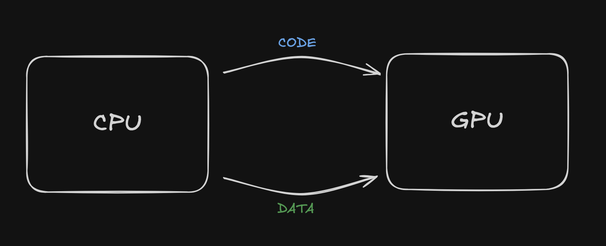

# Shaders

## The OpenGL philosophy

The CPU communicates with GPU

- We are going to send shaders code to the GPU - **HOW TO DRAW**
- We are goign to send data - **WHAT TO DRAW**

## How do we render a triangle?

